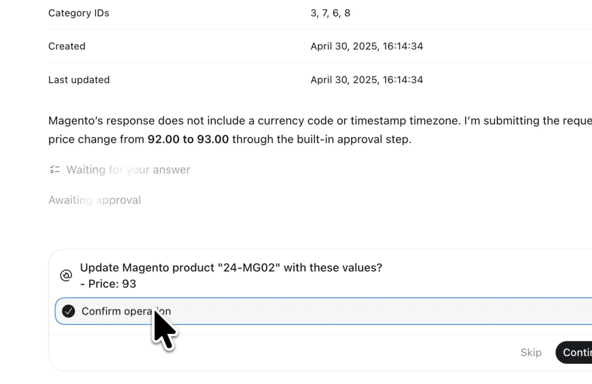
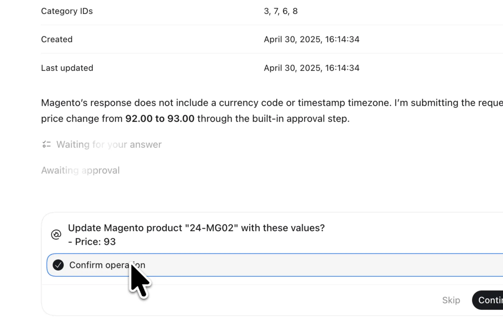
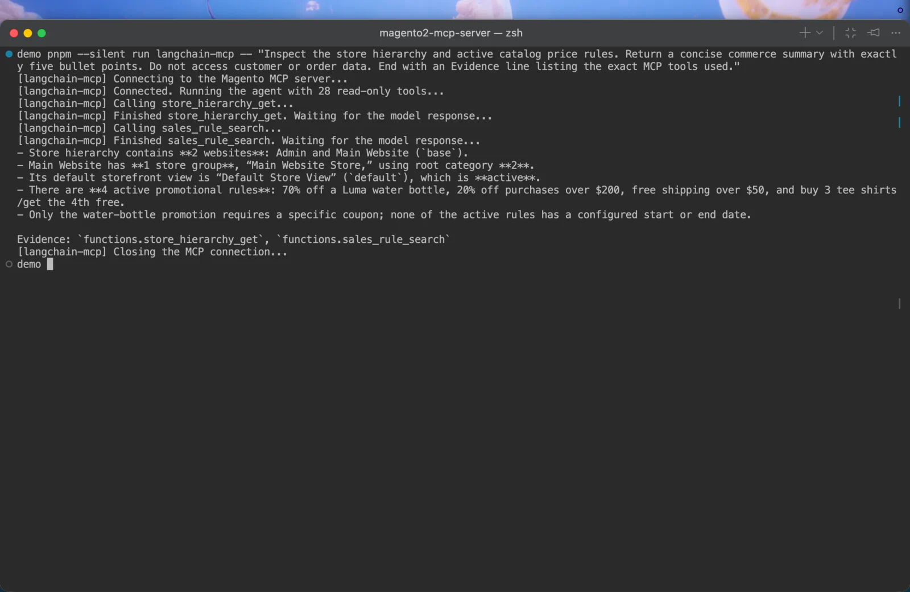
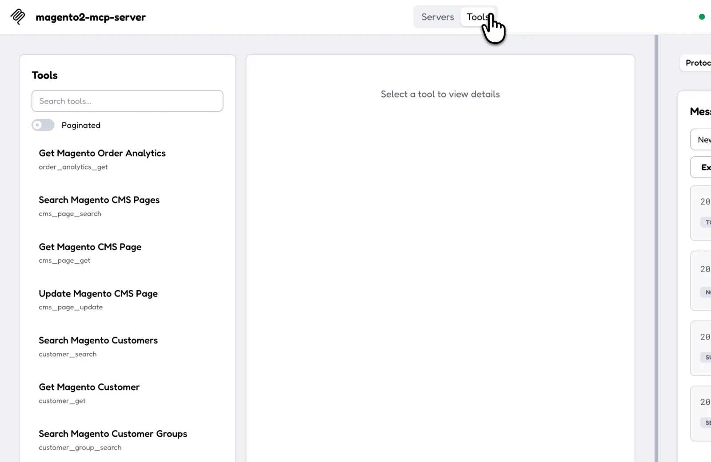
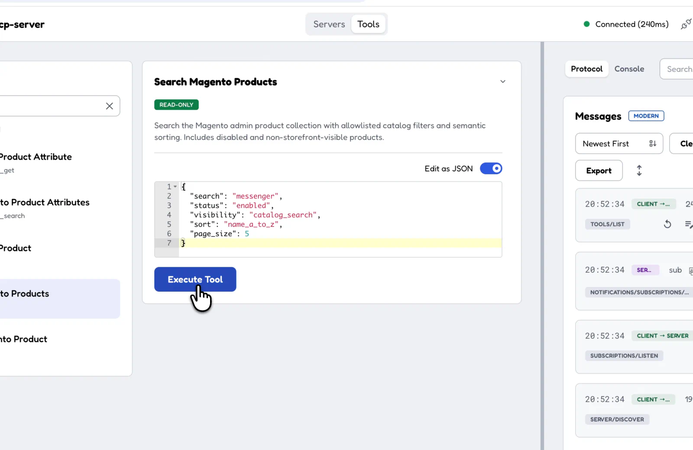
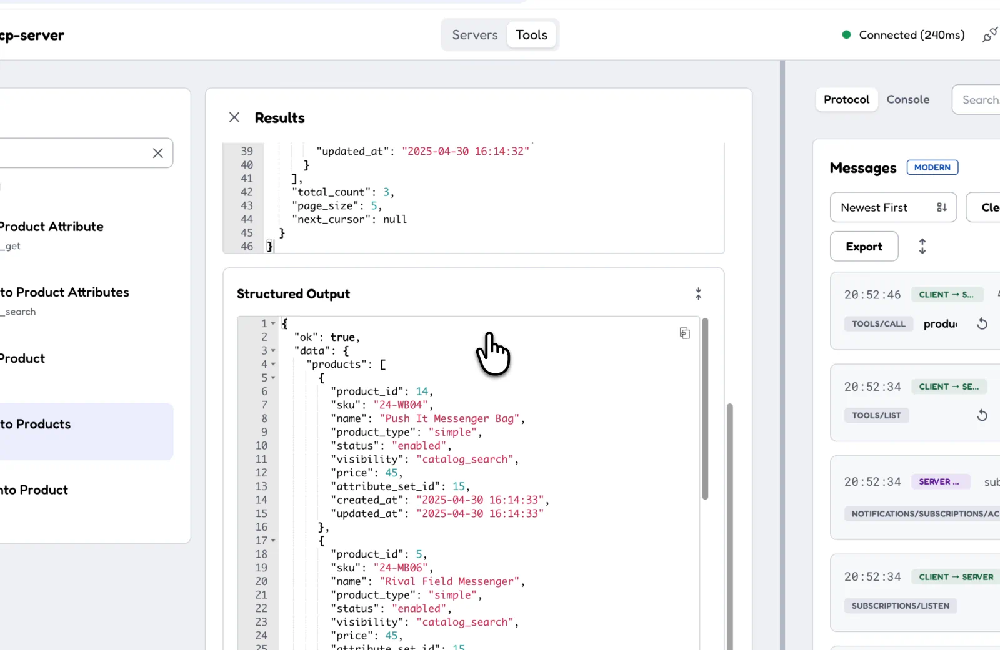

# Magento 2 / Adobe Commerce MCP Server

A TypeScript MCP server for AI agents that manage Magento 2 / Adobe Commerce back-office tasks.

Use it to build real merchant and operations AI agents.

## Demo

See a protected write confirmation, a LangChain agent using the server, and the complete MCP
Inspector flow from tool discovery to structured product search results:



_All data shown is from a demo store._

<details>
<summary>View individual screenshots</summary>

### Confirm a protected write operation

[](docs/assets/demo/write-confirmation.webp)

### Use the server from a LangChain agent

[](docs/assets/demo/langchain-agent.webp)

### Browse the tool catalog

[](docs/assets/demo/inspector-tools.webp)

### Run a filtered product search

[](docs/assets/demo/inspector-product-search.webp)

### Inspect structured results

[](docs/assets/demo/inspector-product-results.webp)

</details>

## Features

- **39 admin tools:** 28 read tools and 11 write tools cover orders, fulfillment, customers,
  products, inventory, quotes, CMS, promotions, analytics, and store information.
- **Clear domain names:** names such as `order_search`, `customer_get`, and `product_update` help
  agents choose the right tool.
- **Focused tools:** each tool handles a specific admin task and uses fixed Magento REST routes. The
  tools accept defined fields, filters, and sort choices instead of accepting any REST request.
- **Strict tool contracts:** every tool has Zod input and output schemas, an MCP `outputSchema`,
  structured content, and the same result as JSON text. The server also checks Magento responses.
- **Small, useful responses:** tools return approved fields instead of raw Magento data. Filters,
  page limits, signed cursors, and response size limits keep results focused.
- **Clear errors:** structured errors explain what went wrong and include `retryable` so an agent
  knows whether another attempt may help.
- **MCP annotations:** tools describe read, destructive, and idempotent behavior.
- **Controlled Magento access:** every request uses the configured HTTPS origin and store scope.
  OAuth 1.0a signs the request, and Magento applies the integration ACL.
- **Request deadlines and safe retries:** every Magento request has a deadline. A GET request may run
  one more time after a network error or HTTP 502, 503, or 504.
- **Safe write actions:** native MCP confirmation and protected state bind the approval to the method,
  tool, and checked input. A UUID `idempotency_key` can return a saved result instead of changing
  Magento again. An unknown result keeps the key reserved.
- **Safe audit records:** each completed tool call records its time, request ID, tool, result,
  duration, and Magento request count. Credentials, raw Magento data, and error messages stay out of
  the audit file.
- **Tools for larger tasks:** `order_analytics_get` and `store_hierarchy_get` collect related data in
  one call.
- **Private configuration:** the Magento URL, store scope, and OAuth credentials stay inside the
  server environment for the life of the process.
- **Ready to integrate and test:** the project includes stdio and Streamable HTTP transports,
  examples for popular AI stacks, Vitest coverage, and optional live tests.

See the [tool catalog](docs/tool-catalog.md) for every tool and its purpose.

## Transports

The two transports expose the same 39 tools. One server process runs one transport.

- **stdio** carries MCP JSON-RPC through stdin and stdout. Stdout is reserved for protocol messages;
  diagnostics use stderr.
- **Streamable HTTP** listens on `127.0.0.1`, serves the fixed `/mcp` endpoint, and checks `Host` and
  `Origin`. `MCP_HTTP_PORT` selects the port and defaults to `3000`.

## Requirements

- Node.js 24.x
- pnpm 10.3.0
- A Magento 2 / Adobe Commerce instance reachable over HTTPS
- Magento OAuth 1.0a integration credentials with ACL access for the tools you plan to use

## Setup and launch

Run these commands from the repository root:

```bash
pnpm install --frozen-lockfile
cp .env.example .env.local
pnpm build
```

Set the Magento HTTPS origin, store scope, OAuth credentials, request deadline, and audit path in
`.env.local`. Use `MAGENTO_STORE_SCOPE=default` for the Default Store View,
`MAGENTO_STORE_SCOPE=all` for global scope, or another configured store view code. The full setting
reference is in [Environment settings](docs/environment.md).

Start the stdio transport:

```bash
node --use-system-ca --env-file=.env.local dist/transports/stdio.js
```

Start loopback Streamable HTTP:

```bash
node --use-system-ca --env-file=.env.local dist/transports/http.js
```

The default HTTP endpoint is `http://127.0.0.1:3000/mcp`.

## Client examples

- [MCP Inspector](docs/inspector.md)
- [Claude Desktop](examples/claude-desktop/README.md)
- [Claude Agent SDK](examples/claude-agent-sdk/README.md)
- [OpenAI Agents SDK](examples/openai-agents-sdk/README.md)
- [LangChain MCP adapter](examples/langchain-mcp-adapter/README.md)
- [Vercel AI SDK](examples/vercel-ai-sdk/README.md)

## Development

Run formatting, lint, type checks, tests, and the build:

```bash
pnpm check
```

Run the read smoke tests against the site configured in `.env.local`:

```bash
pnpm test:live
```

## Documentation

- [Deployment](docs/deployment.md)
- [Security](docs/security.md)
- [Environment settings](docs/environment.md)
- [Tool catalog](docs/tool-catalog.md)
- [Error handling](docs/error-handling.md)
- [Client examples](examples/README.md)

## License

[MIT](LICENSE). This independent open-source project is unaffiliated with Adobe.
